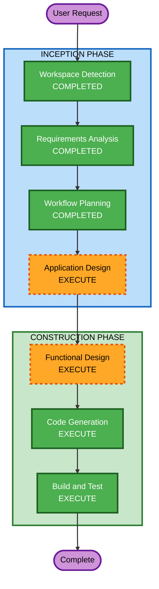

# Execution Plan — Smart Storage: IT Peripheral Recognition System

## Detailed Analysis Summary

### Change Impact Assessment
- **User-facing changes**: Yes — new desktop application with GUI
- **Structural changes**: Yes — new project from scratch (greenfield)
- **Data model changes**: Yes — classification rules, CSV export schema
- **API changes**: No — standalone desktop application
- **NFR impact**: Minimal — performance targets for real-time video processing

### Risk Assessment
- **Risk Level**: Low — well-understood CV algorithms, standard Python stack
- **Rollback Complexity**: Easy — greenfield project, no existing system affected
- **Testing Complexity**: Moderate — requires real images and webcam for full testing

---

## Workflow Visualization

### Mermaid Diagram



### Text Alternative

```
Phase 1: INCEPTION
  - Workspace Detection (COMPLETED)
  - Requirements Analysis (COMPLETED)
  - Workflow Planning (COMPLETED)
  - Application Design (EXECUTE)

Phase 2: CONSTRUCTION
  - Functional Design (EXECUTE)
  - Code Generation (EXECUTE)
  - Build and Test (EXECUTE)
```

---

## Phases to Execute

### INCEPTION PHASE
- [x] Workspace Detection (COMPLETED) — Greenfield detected
- [x] Requirements Analysis (COMPLETED) — 10 FR + 5 NFR documented
- [ ] User Stories — SKIP
  - **Rationale**: Academic/demo project with single user persona. Requirements are clear and complete. User stories would not add significant value.
- [x] Workflow Planning (IN PROGRESS)
- [ ] Application Design — EXECUTE
  - **Rationale**: New multi-component system needs component identification: pipeline modules, GUI, video processor, CSV exporter, classification engine. Component methods and interactions need definition.
- [ ] Units Generation — SKIP
  - **Rationale**: Single cohesive desktop application. No need for multiple independent units of work. All components are tightly coupled within one application.

### CONSTRUCTION PHASE
- [ ] Functional Design — EXECUTE
  - **Rationale**: Complex classification logic (color + size rules), two color detection methods (HSV + K-means), pipeline stage interactions, and decision engine need detailed design.
- [ ] NFR Requirements — SKIP
  - **Rationale**: NFR requirements are straightforward (performance targets already defined in requirements). No special security, scalability, or infrastructure concerns for a local desktop app.
- [ ] NFR Design — SKIP
  - **Rationale**: NFR Requirements stage skipped, so NFR Design is not needed.
- [ ] Infrastructure Design — SKIP
  - **Rationale**: Local desktop application with no cloud infrastructure, no deployment architecture, no server-side components.
- [ ] Code Generation — EXECUTE (ALWAYS)
  - **Rationale**: Full implementation of the CV pipeline, GUI, video processing, and CSV export. User requested granular task decomposition for complex tasks.
- [ ] Build and Test — EXECUTE (ALWAYS)
  - **Rationale**: Build instructions, test instructions, and verification needed.

### OPERATIONS PHASE
- [ ] Operations — PLACEHOLDER

---

## Estimated Timeline
- **Total Stages to Execute**: 4 (Application Design, Functional Design, Code Generation, Build and Test)
- **Total Stages to Skip**: 5 (User Stories, Units Generation, NFR Requirements, NFR Design, Infrastructure Design)

## Success Criteria
- **Primary Goal**: Working CV system that processes real images through the full pipeline and produces classification decisions
- **Key Deliverables**:
  1. Working Python application with full pipeline (enhance, segment, clean, detect, decision)
  2. GUI displaying all pipeline stages
  3. Real-time webcam video processing
  4. CSV export of classification results
  5. Two color detection methods with comparison capability
  6. README with installation and usage instructions
  7. Sample test images
- **Quality Gates**:
  - All 5 pipeline stages produce visible output
  - Classification correctly identifies at least 5 categories of IT peripherals
  - Video processing achieves minimum 5 FPS
  - CSV export contains all required fields
  - Both HSV and K-means methods produce results
